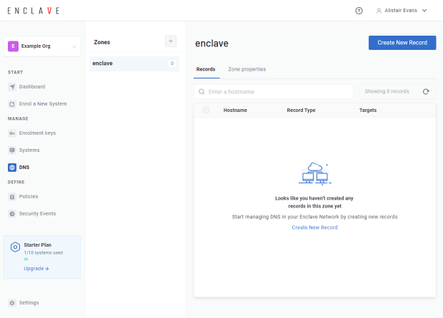
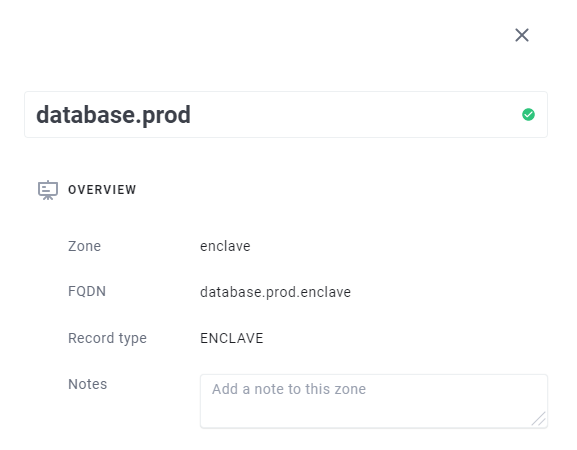
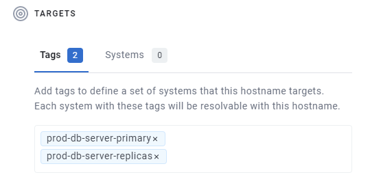
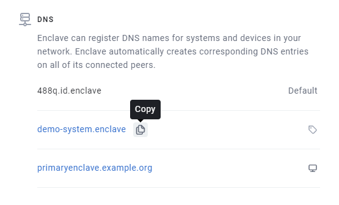
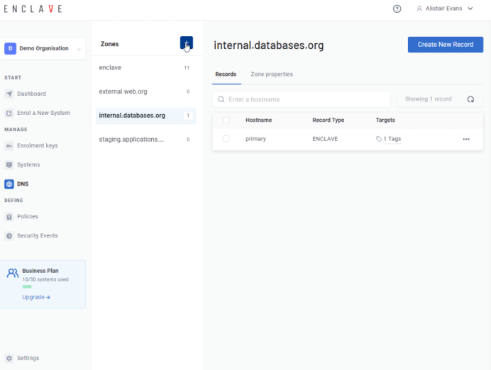

DNS is the mechanism by which a name, e.g. `myserver.enclave` is resolved to an IP Address; in our case, an Enclave IP Address (e.g. `100.84.10.20`).

The Enclave DNS feature provides built-in DNS support for Enclave and allows you to define your own DNS names from a single central location [in the portal](https://portal.enclave.io/my/dns) or via our APIs.

On each Enclave System, the installed agent runs a local authoritative DNS nameserver, bound to the local Enclave Virtual Adapter, that provides DNS services.

> On Windows and macOS, we automatically configure the operating system to use the Enclave nameserver. However on Linux you currently need to
> configure your DNS manually (because of the big variation in Linux DNS configurations). 
> See our knowledge base article on [how to configure DNS on Linux](/kb/how-to-configure-dns-forwarding-on-linux).

## Automatic ID Names

When a System is enrolled, it is assigned a short, unique, **System ID**. This System ID is displayed in the System's detail view [in the portal](https://portal.enclave.io/my/systems), in the Windows tray application, and when you run `enclave status` from the command line.

All systems are automatically assigned a name based on their System ID, `{systemId}.id.enclave`. So, as an example, if a system has the id `488Q`, it will always have the 
DNS name `488q.id.enclave`.

## Adding a DNS Record

To create a custom DNS record, go to your DNS settings in [the portal](https://portal.enclave.io/my/dns). 

> Organisations on our Business Plan can create additional custom DNS Zones in addition to the default **enclave** zone.
> See the [section below](#custom-zones-business-plan) on custom DNS zones for more info.

To create a new DNS record, click "Create New Record"; then specify the hostname you want. You will get a preview of the fully-qualified domain name (FQDN)
as you type.

Hostnames can only contain alphanumeric characters (A-Z,0-9), hyphens, and a period character to separate sections of the name.

> You can also enter the special '@' character on its own to create an **apex record**, which creates a record with the name of the zone.

### Adding Targets

There are two ways to specify which systems should be resolved for a given DNS name.

The first is using [Tags](tags.md).  You can specify a list of tags for the hostname. Any system with **one of the specified tags** will be resolvable from the name you defined.

The second is by specifying exactly the systems you wish to resolve with that name.

In general, we suggest attaching DNS names by tag if you can, because it is less brittle, and easy to replace the System that provides a given application or service without updating the DNS record.

You can combine tag and system targeting on a single DNS record.

## Viewing Names applied to a System

In the Detail pane of each System in your Organisation, there is the full list of all names currently applied to the system, as well as an indication as to how that system got
the name (via a system or tags assignment).

## DNS Load Balancing

If more than system has a given name assigned to it, either directly, or because of a tag, then implicit DNS load balancing kicks in.

If a System resolves a name with multiple systems assigned to it, it will randomly resolve to one of the systems **it is connected to**
with that name.

That last point about being connected to the system is important, because it means you can also set up geographically segmented networks that resolve a 
different System IP Address based on the policies in place for the System, all from the same DNS name.

## Why no TTL?

DNS changes you make in the portal are propagated immediately to every impacted system, without any need to specify a Time-To-
Live for the record.

You don't need to worry about systems getting out of sync with regards to what names they understand.

## Custom Zones (Business Plan)

Every organisation has a default `enclave` zone pre-defined, to which you can add as many DNS records as you wish, but they will all
have the `.enclave` suffix on your names.

Organisations on our Business Plan (see [pricing](https://enclave.io/pricing/)) can also create any number of **custom** zones, with any 
TLD they wish.

You can use this feature to help organise your DNS names, or create names that match certificates issued for existing publicly-managed names.

### Renaming Zones

You can rename a custom zone after creating it. This will update the FQDN (fully-qualified domain name) of all records inside the zone to respect the new FQDN.

Changing a zone's name will immediately change all of the DNS names on that zone from the perspective of client systems, so make sure you understand what systems
might need to be reconfigured after the change.

> Note, you will not be able to rename a zone if the new name results in record FQDN clashes with names in an existing zone.

