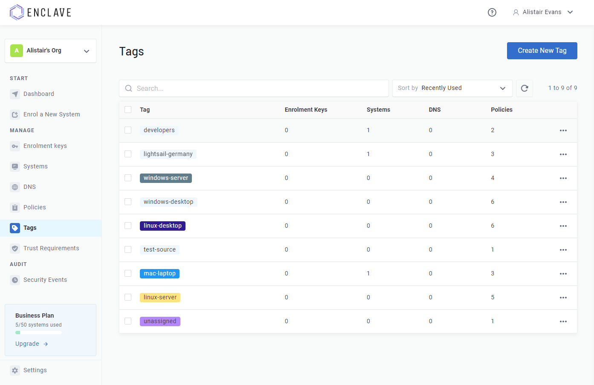

Tags are free-form text labels attached to one or more systems in your account which allow administrators to group systems together which share similar characteristics (i.e. business unit, security level or function) in order to build connectivity between them.

Tags can be manually added to enrolled systems, or an [Enrolment Key](/management/enrolment/) can be configured to apply an initial set of Tags to new systems as they enrol to your account.

## Usage

Tags form the building blocks of [policies](/management/policy/) and policies define connectivity between enrolled systems. Instead of directly attaching systems to a Policy, Administrators use Tags to freely group enrolled systems together which can be referenced once across many policies. The decoupling which Tags provide allows policies to be defined once and remain static, while the business shifts and evolves underneath.

For example, if an Administrator creates a ==developers== Tag and a ==kubernetes-pods== Tag, and then defines a `Kubernetes access` Policy which allows ==developers== direct access to ==kubernetes-pods==; then systems in the ==developers== Tag can change over time, so can members of the ==kubernetes-pods== Tag as new instances are spun up and old instances are shutdown. The policy however (the business intent underpinning connectivity between those groups) remains in-place, constant and unchanged.

> **Managed vs. unmanaged systems:** When one or more Tags are attached to a system, that system automatically switches into Managed mode. This means all connectivity for that system must be defined by Policy and that the Enclave software on that system will no longer accept commands from the local user(s). Conversely, if no Tags are attached to a system then the opposite is true; the system enters Unmanaged mode and users are able to configure and control the Enclave software locally.

## Naming conventions

It is considered best practice to define a naming pattern which reflects the structure and security model of your organisation, and group systems along those lines when defining Tags. 

A valid Tag name is composed of lower-case characters (`a-z` and `0-9` without spaces) and may be up to 64 characters long. Valid separator characters include `-` and `.`

Tags names should be made up of designators which represent your organisational structure. Consider designations for your organisation which group systems:

* By user geography: ==uk==, ==london== or ==nyc-office==

* By business unit: ==developers==, ==sales== or ==marketing==

* By security level: ==staging==, ==production== or ==uat==

* By function: ==webservers==, ==database-servers== or ==intranet==

* By infrastructure: ==aws-eu-west-2== or ==dc-lax-11==

* By project: ==us-gov== or ==f22-raptor==

You may also decide to combine multiple designations into a single Tag. We suggest using the period character `.` to include multiple designations as part of a single Tag name, with the most specific designator placed last.

* ==f22-raptor.rapid-prototype-team==
* ==nyc-office.developers==
* ==aws-eu-west-2.production.webservers==
* ==dc-lax-11.intranet==
* ==uk.laptops==
* ==uk.laptops.developers==
* ==all-staff==
* ==contractors==

Once defined, account Administrators can add member systems to Tags and compose Policies to create connectivity.

| Policy Name          | Sender Tags                                              | Receiver Tags                                                              |
| -------------------- | -------------------------------------------------------- | -------------------------------------------------------------------------- |
| Access to Jira       | ==all-staff== ==contractors==                       | ==dc-lax-11.jira==                                                         |
| Access to preprod db | ==uk.laptops.developers== ==nyc-office.developers== | ==aws-eu-west-2.staging.db-servers== ==aws-eu-west-2.uat.db-servers== |
| R22 prototype team   | ==f22-raptor.rapid-prototype-team==                      | ==f22-raptor.rapid-prototype-team==                                        |

> **Note:** When the same Tag is applied to both the `Sender` and `Receiver` sides of the same policy Enclave will create connectivity _between_ that Tag's member systems. In this case, forming a fully connected mesh and community of interest between members of the ==f22-raptor.rapid-prototype-team== Tag. You should consider the capabilities of your underlying network infrastructure when deploying a fully connected mesh. [Learn more](/keywords/full-mesh).

## Automatic Creation vs Manual Creation

Tags can be automatically created wherever you need to use them; there's no need to pre-define a tag before using it. 

However, for easier management, you can add/rename/remove tags from within the 'Tags' page:

You can assign a colour for a tag. This can make it easier to visually distinguish tags at-a-glance.

## Trust Requirements

You can assign [Trust Requirements](./trust-requirements/index.md) to a tag from the Tags screen; trust requirements applied to a tag are applied to all systems with that tag, and restrict all policies that depend on that tag.

For example, let's say you define:

- A ==developers== tag
- A trust requirement "Must be Logged In", and add it to the ==developers== tag
- A "Developer Access to Test Environment" policy with:
  
    ==developers== --> ==test-env==

- A "Developer Access to Build Servers" policy with:

    ==developers== --> ==build-servers==

With this configuration, because there is a trust requirement on the tag ==developers==, neither of our defined policies
will take effect until the user is logged-on to the device.

This makes it easier to manage trust requirements that apply to *all* connectivity for a particular system or group of systems.
