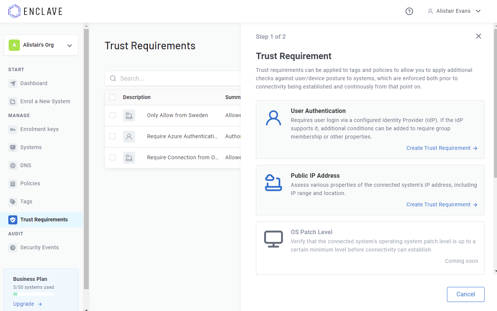
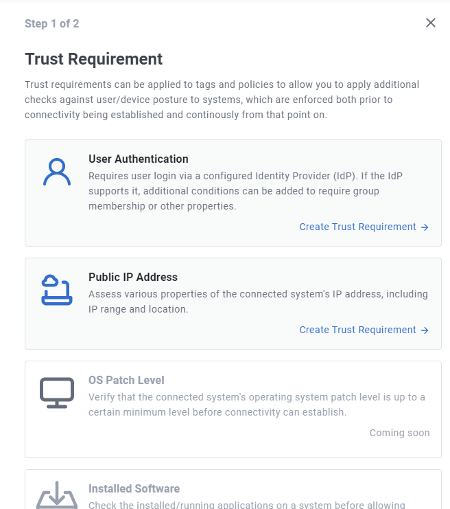

# What are Trust Requirements?

A fundamental tenet of deploying a zero-trust network access architecture is that we start from 'zero' trust, and we use additional indicators of trust, such as user authentication, device security posture and device location, to determine if connectivity from a device to a resource should be established.

Until the necessary trust *requirements* are met, no access to the resource should be possible.

This is where our **Trust Requirements** feature comes from.

Enclave trust requirements are continuously evaluated properties of a system enrolled with Enclave, collected either from the local endpoint, or from a remote API, that can be either *met*, meaning the enrolled system has passed all conditions on the requirement, or *unmet*, meaning that the enrolled system **has not** passed all the conditions on the requirement.

Trust Requirements can be added from within the portal (or via our APIs):

Once you have defined the trust requirements you want, you can add these to:

- A [Policy](../policy.md), as a "Sender Trust Requirement", meaning that for the connectivity defined by the policy to take effect, the systems on the sender side of the policy must have met *all* the trust requirements applied to the policy. 

- A [Tag](../tags.md), meaning that anywhere the tag is used to configure connectivity via a policy, the trust requirement must be met. This can be a useful way to specify requirements that apply to a lot of different policies.
  
    > Want to apply a trust requirement to the receiver side of a policy? Apply the requirement to the tag(s) on the receiver side instead of in the policy.

## Trust Requirement Types

Each 'type' of trust requirement typically has very different configuration options and conditions to apply, so we separate them out by type:

Don't see a Trust Requirement you want? [Get in touch](../../support/contact.md), and we may be able to add support for your specific trust use-case.
