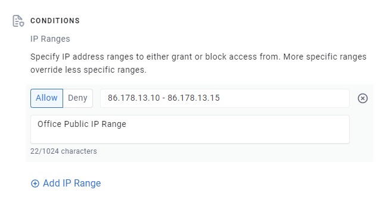
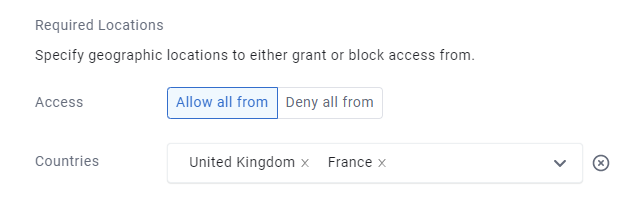

# Public IP Address

The Public IP Address trust requirement allows you to apply conditions to the public, internet-facing IP address of an enrolled Enclave system.

This requirement can be useful for:

- Requiring that certain connections can only happen if a device is in your office.
- Preventing connectivity from outside the country, to help meet regulatory requirements.

## IP Ranges

Under IP Ranges, you can specify multiple IP Range rules, using:

- A single IP Address
- A range of IP Addresses
- A subnet in CIDR Notation

Each range entry can be set to "Allow", meaning the connected system must be in the specified range to meet the requirement, or "Deny", meaning the connected system must *not* be in the specified range to meet the requirement.

Multiple "Allow" items mean that matching *any* of the ranges indicate the system is allowed, and multiple "Deny" items mean that matching *any* of the ranges indicate the system is denied.

You can have overlapping Allow and Deny rules, in which case **the most specific range wins**. That is, if you specify:

- Allow - `0.0.0.0/0`
- Deny - `86.10.10.0/24`
- Allow - `86.10.10.5`

Then a connection from `86.10.10.5` or `194.10.2.66` would meet the requirement, and `86.10.10.16` would *not* meet the requirement.

## Required Locations

You can also specify required or blocked geographic locations for connected systems.

Indicating that you wish to allow all connections from `United Kingdom` implicitly denies connections from any other countries. Conversely, indicating that you want to *deny* all connections from `Belgium` and `Norway` would allow connections from any *other* country, except `Belgium` and `Norway`.

> We use the [ipdata.co](https://ipdata.co) service to determine the location of a given IP address; if that service is unavailable, your systems will be unable to meet this requirement until the service becomes available again.
> 
> [Contact us](../../support/community-support.md) if you believe that we are detecting the incorrect location for a connected system.

