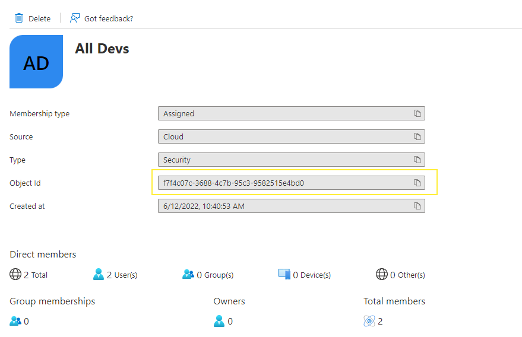

# User Authentication

A User Authentication trust requirement allows you to require that a user must have authenticated with a nominated **authority** on their device before connectivity can establish.

An **authority** is a provider of authentication, sometimes called an Identity Provider (or IdP).  You can have a different authority for each trust requirement, if you wish (this can be useful when managing a diverse estate of authentication providers).

When this trust requirement is applied, users will be presented with the prompt to authenticate, at which point we conduct the authentication flow with the nominated authority.

## Supported Authorities:

Enclave currently supports the following authorities:

- Microsoft (Azure Active Directory); users must log in using an Azure Active Directory (or Office 365) account.

- Enclave Portal; users must have an Enclave Portal admin account with access to the organisation. This can be useful for requirements targeting network administrators.

> Need a specific or custom authentication provider? [Get in touch](../../support/contact.md), and we may be able to add support for your customer authentication provider.

### Microsoft


For Microsoft Authentication, you should provide the Tenant ID, which indicates which Azure AD tenant the user should exist in.

You can get your Tenant ID from the Azure Portal:


#### Security Group

In addition to generally require authentication via your tenant, you can also specify an Azure AD **Security Group ID**. Users must then be a member of that security group in order to meet the trust requirement.

Using security groups you can create finely-grained connectivity rules that maps your user security assignments to the resources they can access.

The Security Group ID is the "Object ID" in Azure for that group:



## Authenticating

If you're running Windows, and you need to provide authentication credentials, you will get a notification in your system tray that login is required; upon opening the tray application, you will be presented with a Login button to initiate the login process.

On Linux and macOS, where we do not currently have a tray app, you can open a terminal and run:

```bash
enclave auth
```

This will launch the appropriate authentication flow via the system browser.

### Non-interactive Contexts

In a system where we cannot launch a web browser to complete an authentication flow (for example, in an SSH session to a raspberry pi), running `enclave auth` will initiate a "device flow", where you can visit a URL on another device, enter a code, and complete the authentication process that way.


